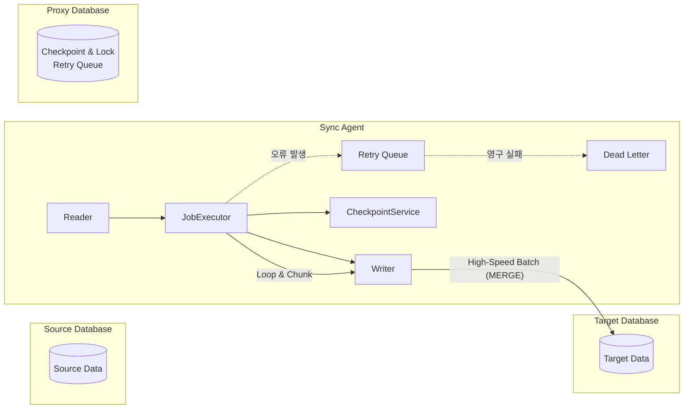

# Oracle-to-Oracle Data Sync Agent 🚀

본 프로젝트는 Oracle 데이터베이스 간에 대용량 데이터를 고속으로 동기화하기 위한 엔터프라이즈급 에이전트입니다. Spring Boot와 Spring Data JPA, JdbcTemplate을 활용하여 안정성과 성능을 극대화했습니다.

## 🌟 핵심 기능 (Key Features)

- **3-DB 아키텍처**: Source(데이터 원천), Target(데이터 목적지), Proxy(메타데이터/체크포인트)의 물리적 분리를 통해 트래픽 간섭 최소화.
- **JdbcTemplate 벌크 연산 (MERGE INTO)**: `JdbcTemplate`의 `batchUpdate`와 Oracle의 `MERGE INTO` 쿼리를 결합하여 대량의 Upsert 작업을 고속으로 처리.
- **청크 기반 연속 처리 (Continuous Chunking)**: 스케줄 시작 시 백로그가 모두 처리될 때까지 설정된 청크 단위로 루프를 돌며 빠짐없이 데이터를 처리.
- **적응형 청크 사이징 (Adaptive Chunk Sizer)**: 동기화 쓰기 처리 속도에 맞춰 청크 사이즈를 동적으로 조절하여 DB 부하 완화 및 최적의 처리량 유지.
- **안정적인 오류 복구 (Retry Queue & DLQ)**: Oracle의 예외(ORA 에러)를 분석해 영구적(Permanent) 오류와 일시적(Transient) 오류를 구분. 실패한 데이터는 재시도 큐(Retry Queue)에 담아 지수 백오프(Exponential Backoff)로 재시도하며, 해결 불가 시 DeadLetter 처리.
- **분산 락 (ShedLock)**: 다중 인스턴스 환경에서도 중복 실행 없이 안전하게 동기화 작업 보장.
- **상태 및 지연 모니터링 (Lag Monitor)**: Source와 Target 간의 데이터 지연(Lag) 상태를 추적하고 Prometheus 지표로 제공.

## 🛠 시스템 아키텍처



## ⚙️ 실행 환경 설정

### 1. 전제 조건
- Java 8 이상
- Oracle Database 12c 이상 (Source, Target, Proxy 각각의 스키마 혹은 독립 인스턴스)
- Maven 3.6 이상
- Docker (테스트 시 활용)

### 2. 데이터베이스 설정 (DDL)
각 DB에 동기화를 위한 비즈니스 및 메타데이터 테이블이 필요합니다.
- **Proxy DB**: `SYNC_CHECKPOINT`, `BATCH_RETRY_QUEUE`, `SHEDLOCK`
- **Source/Target DB**: 대상 비즈니스 테이블 (`ORDERS` / `ORDERS_TARGET`)

### 3. application.yml 구성
`src/main/resources/application.yml` 파일에서 각 DB 접속 정보와 동기화 스케줄 설정을 구성합니다.

```yaml
spring:
  datasource:
    source:
      jdbc-url: jdbc:oracle:thin:@localhost:1521/FREEPDB1
      username: source
      password: (비밀번호)
    target:
      jdbc-url: (대상 DB URL)
    proxy:
      jdbc-url: (체크포인트/락 DB URL)
```

## 🚀 실행 가이드

### 빌드 및 컴파일
```bash
mvn clean compile
```

### 어플리케이션 실행
```bash
mvn spring-boot:run
```

### Docker 기반 테스트 실행 (로컬 Oracle)
통합 테스트는 외부 종속성(TestContainers 미사용) 대신 호스트(`host.docker.internal`)에 띄워진 로컬 Oracle(1521 포트)을 활용하여 수행할 수 있습니다.

```bash
# 테스트용 Docker 이미지 빌드
docker build -t oracle-sync-agent-test .

# Docker 컨테이너를 통한 테스트 실행
docker run --rm -e DB_HOST=host.docker.internal --add-host=host.docker.internal:host-gateway oracle-sync-agent-test
```
*(자세한 사항은 `.claude/test-plan-docker.md` 참고)*

## 📄 모니터링 및 메트릭
어플리케이션은 기본적으로 Prometheus 형식의 메트릭을 수집 및 노출합니다.
- **Endpoint**: `http://localhost:8080/actuator/prometheus`
- **주요 지표**: 
  - `sync.read.duration`, `sync.write.duration`: 읽기/쓰기 처리 속도
  - `sync.lag.count`: 소스와 타겟의 격차
  - `sync.retry.enqueue`, `sync.deadletter.enqueue`: 오류 재시도/실패 건수

---
**주의**: 이 프로젝트는 Oracle 환경에 특화된 배치 및 예외 처리 로직을 포함하고 있어 Oracle 12c 이상(19c 이상 권장)에서 가장 뛰어난 성능을 발휘합니다.
