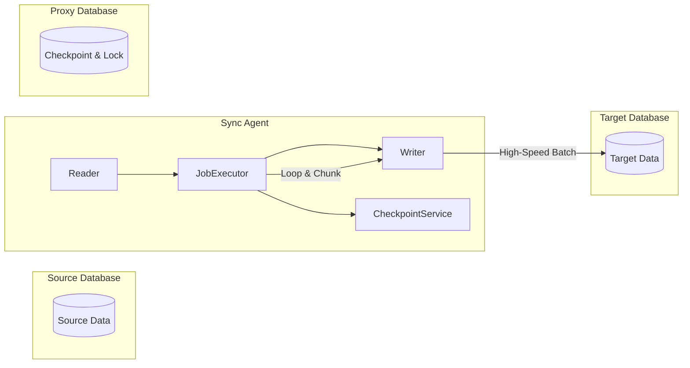

# Oracle-to-Oracle Data Sync Agent 🚀

본 프로젝트는 Oracle 데이터베이스 간에 대용량 데이터를 고속으로 동기화하기 위한 엔터프라이즈급 에이전트입니다. Spring Boot와 QueryDSL을 활용하여 안정성과 성능을 극대화했습니다.

## 🌟 핵심 기능 (Key Features)

- **3-DB 아키텍처**: Source(데이터 원천), Target(데이터 목적지), Proxy(메타데이터/체크포인트)의 물리적 분리를 통해 트래픽 간섭 최소화.
- **QueryDSL-SQL 벌크 연산**: `SQLUpdateClause`와 `SQLInsertClause`의 배치를 활용하여 단 2회의 쿼리로 대량의 Upsert 작업 완료.
- **청크 기반 연속 처리 (Continuous Chunking)**: 스케줄 시작 시 백로그가 모두 처리될 때까지 설정된 청크 단위로 루프를 돌며 안정적으로 끝까지 처리.
- **적응형 성능 조절**: 쓰기 속도에 따라 청크 크기를 동적으로 조절하는 Adaptive Chunking 기술 적용.
- **분산 락 (ShedLock)**: 다중 인스턴스 환경에서도 중복 실행 없이 안전하게 동기화 작업 보장.

## 🛠 시스템 아키텍처



## ⚙️ 실행 환경 설정

### 1. 전제 조건
- Java 8 이상
- Oracle Database (Source, Target, Proxy 각각의 스키마 혹은 인스턴스)
- Maven 3.6 이상

### 2. 데이터베이스 설정 (DDL)
각 DB에 최소한의 메타데이터 테이블이 필요합니다.

- **Proxy DB**: `SYNC_CHECKPOINT`, `BATCH_RETRY_QUEUE`, `SHEDLOCK` 테이블
- **Source/Target DB**: 대상 비즈니스 테이블 (`ORDERS_SOURCE` / `ORDERS_TARGET`)

### 3. application.yml 구성
`src/main/resources/application.yml`에서 각 DB 접속 정보를 설정합니다.
```yaml
spring:
  datasource:
    source:
      jdbc-url: jdbc:oracle:thin:@localhost:1521/FREEPDB1
      username: source
      password: (비밀번호)
    target:
      jdbc-url: (대상 DB URL)
    proxy:
      jdbc-url: (체크포인트 DB URL)
```

## 🚀 실행 가이드

### 빌드 및 컴파일
QueryDSL QClass 생성을 포함하여 빌드를 진행합니다.
```powershell
mvn clean compile
```

### 어플리케이션 실행
```powershell
mvn spring-boot:run
```

### 테스트 실행 (로컬 Oracle 기반)
```powershell
mvn test -Dspring.profiles.active=test
```

## 📄 모니터링 및 메트릭
어플리케이션은 기본적으로 Prometheus 형식의 메트릭을 수집합니다.
- **Endpoint**: `http://localhost:8080/actuator/prometheus`
- **주요 지표**: `sync_read_duration_ms`, `sync_write_duration_ms`, `sync_read_errors_total`

---
**주의**: 이 프로젝트는 Oracle 12c(19c 이상 권장) 환경에서 가장 뛰어난 성능을 발휘합니다.
